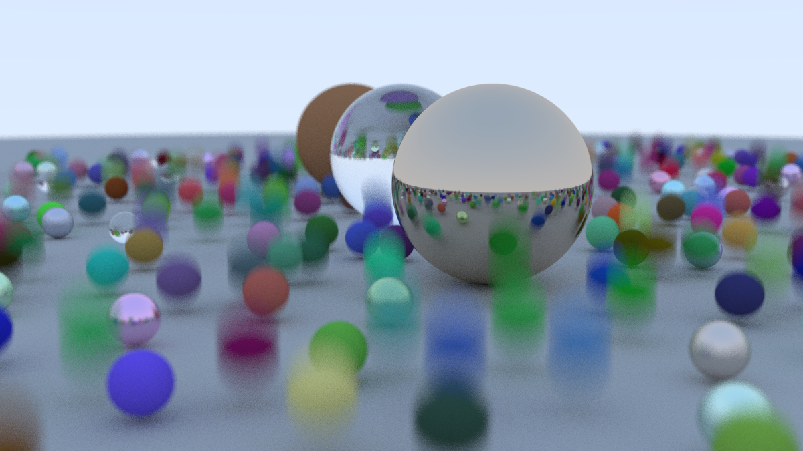

## webgpu ray tracing
browser-based ray tracing implementation using webgpu with no extra dependencies.

[view live demo](https://kclung99.github.io/webgpu-ray-tracing/)

## references 
- [_Ray Tracing in One Weekend_](https://raytracing.github.io/books/RayTracingInOneWeekend.html)
- [_Ray Tracing: The Next Week_](https://raytracing.github.io/books/RayTracingTheNextWeek.html)
- [_WebGPU Fundamentals_](https://webgpufundamentals.org/webgpu/lessons/webgpu-fundamentals.html)